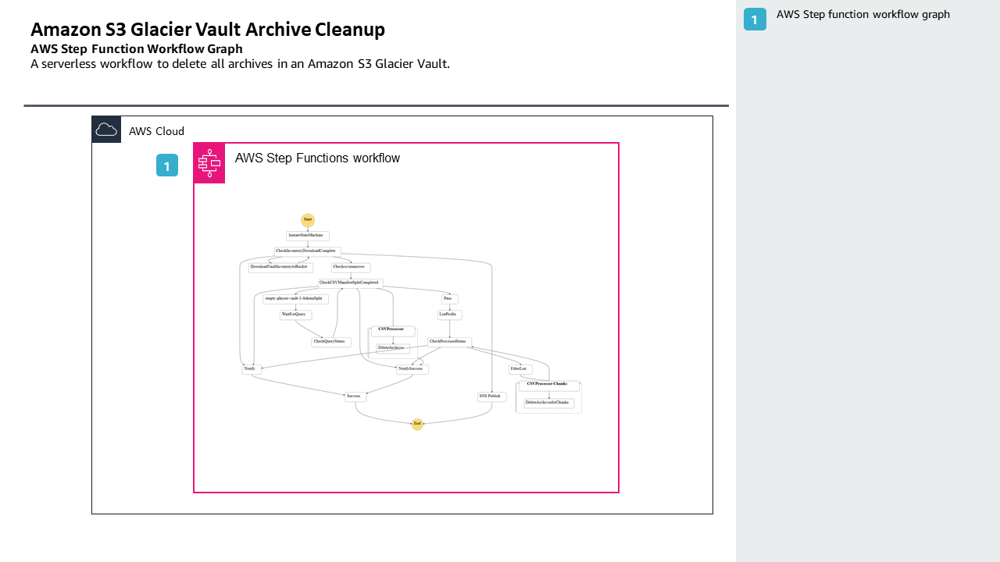
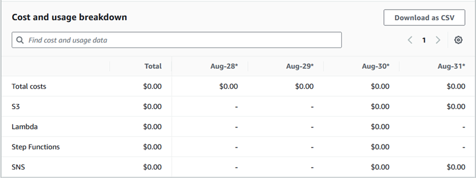
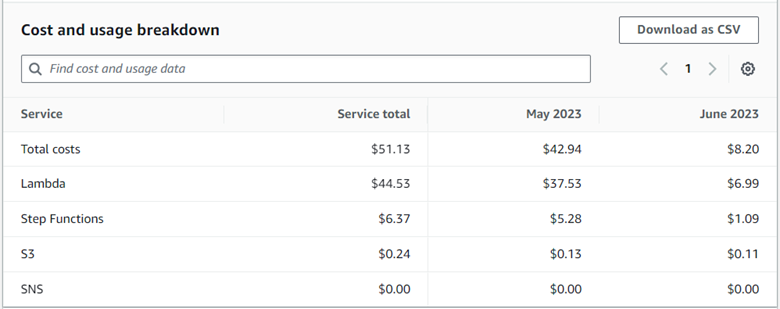

# Glacier Archive (Data) Delete

##  

## Description

[Amazon S3 Glacier](https://docs.aws.amazon.com/amazonglacier/latest/dev/introduction.html) Archive (data) Delete solution provides an automated workflow to delete ALL of your data in an [S3 Glacier Vault](https://docs.aws.amazon.com/amazonglacier/latest/dev/working-with-vaults.html).

 This solution only applies to Amazon S3 Glacier Vault Archives. Within S3 Glacier, data is stored as an Archive within a Vault. This solution does not apply to objects in [Glacier Deep Archive, Glacier Flexible Retrieval, and Glacier Instant Retrieval](https://aws.amazon.com/s3/storage-classes/glacier/) stored in [an Amazon S3 Bucket](https://docs.aws.amazon.com/AmazonS3/latest/userguide/UsingBucket.html). More information on Amazon S3 Glacier can be found in [our documentation](https://docs.aws.amazon.com/amazonglacier/latest/dev/introduction.html). 
 

## Customer Value

The solution automates and orchestrates the complex and repetitive tasks associated with deleting data in an S3 Glacier Vault by emptying it of its Archives. Once the Vault is empty, you can then delete the Vault through a separate process.
 

## Architecture and Components

 
**_Components and Flow:_**
 

_**Step function graph:**_
 

 
**AWS Services used:**

[AWS CloudFormation](https://aws.amazon.com/cloudformation/)

[Amazon Simple Storage Service (S3)](https://aws.amazon.com/s3/)

[Amazon S3 Glacier](https://docs.aws.amazon.com/amazonglacier/latest/dev/introduction.html)

[AWS Step function](https://aws.amazon.com/step-functions/)

[AWS Lambda](https://aws.amazon.com/lambda/)

[AWS Glue](https://aws.amazon.com/glue/)

[Amazon Athena](https://aws.amazon.com/athena/)

[Amazon Simple Notification Service (SNS)](https://aws.amazon.com/sns/)

[AWS Identity and Access Management (IAM)](https://aws.amazon.com/iam/)
 

### Disclaimer

 
Please use this solution with caution. The solution will delete all of your data in the S3 Glacier Vault you specify. Do not deploy this solution unless you have confirmed that you want to permanently delete your data. Once you start this solution, your data is irrecoverable. 
 
The solution template includes two opportunities to confirm that you are aware that your data and Archive will be deleted and irrecoverable. Providing these confirmations during the solution deployment is a confirmation that you accept that your S3 Glacier Vault archive data will be permanently deleted.
 
If you have enabled [S3 Glacier vault lock](https://docs.aws.amazon.com/amazonglacier/latest/dev/vault-lock-policy.html) on your Vault, only objects eligible for deletion can be permanently deleted.
 
The software is provided "as is", without warranty of any kind, express or implied, including but not limited to the warranties of merchantability, fitness for a particular purpose and noninfringement. In no event shall the authors or copyright holders be liable for any claim, damages or other liability, whether in an action of contract, tort or otherwise, arising from, out of or in connection with the software or the use or other dealings in the software.
 
 

### Prerequisites

The instructions in this post assume that you have required AWS Account [IAM permissions](https://docs.aws.amazon.com/IAM/latest/UserGuide/access_policies.html) in addition to basic knowledge of [AWS Cloudformation](https://aws.amazon.com/cloudformation/). You also need to have the following resources:
 

* An existing Amazon S3 Glacier Vault containing the Archives you want to delete.

### Summary of the steps

* [Deploy](https://docs.aws.amazon.com/AWSCloudFormation/latest/UserGuide/GettingStarted.Walkthrough.html) the AWS CloudFormation template 

* Specify the Amazon S3 Glacier vault name, accept the deletion confirmation and optionally set the deletion speed. Please ensure there are no more archive upload operations to your Vault.

* Check your email address and subscribe to the SNS topic to receive Job notifications

* Monitor the job progress via email, once you receive confirmation that the archive deletion is complete, please wait for 24-48 hours, 
  then check the S3 Glacier Management Console to   confirm the Vault is empty.

* Finally, you can then proceed to delete the S3 Glacier Vault.

### Deployment

** **** **
Listed below are the Cloudformation Stack parameters included in the template.
** **** **

|  Name                               | Description |
|:--------------------------------- |:------------ |
|  Stack name                         | Any valid alphanumeric characters and hyphen |
|  Your Amazon S3 Glacier Vault Name  | Amazon S3 Glacier Vault containing the archives you no  longer need. |
|  Confirmation that the Archives in your Glacier Vault  are eligible for Permanent deletion  | For S3 Glacier Vault with Vault lock enabled, please  note that archives are only eligible for deletion when the lock expires. You  also need to check and confirm there are no AWS IAM or resource policies  preventing the archives from being deleted. |
|  I intend to delete all data in my Glacier Vault  | Drop down confirmation of your intent to empty your S3  Glacier Vault |
|  Permanently delete all data in my Glacier Vault?  | You will need to type the ***Permanently Delete***  displayed in the parameter field for the second confirmation |            
|  The speed at which the solution deletes the Archives in  your S3 Glacier Vault  | Do you have other Vaults that you will need to access  during this deletion? This script is set to run as fast as possible to delete your Vault  Archives. If you actively use Vaults for other purposes, consider reducing  this number. \[See Troubleshooting and Guidance Section below\] |                                
|  Email Address to Receive Deletion Progress Notifications  | Your own valid email address to receive deletion progress from the solution |
 
_Steps to deploy:_
 

* Download the solution template “glacier-vault-archive-cleanup-latest.yaml” in the code section above
* Login to [AWS Management Console](https://console.aws.amazon.com/console/home) in the region where the Amazon S3 Glacier Vault exists and navigate to the AWS CloudFormation console.
* Choose Create Stack (with new resources). At the Prerequisite section, accept the default option Template is ready.
* At the Specify Template section, select Upload a template file, choose file and then use the previously downloaded CloudFormation template. After selecting, choose Next.
* You need to specify the Stack name, the Vault name, accept the deletion confirmations and optionally select the deletion speed, the predefined speed is set to **5.**
* Cloudformation will automatically deploy the solutions components and perform some initial checks and actions.
* At the **Configure stack options** page, choose **Next** to proceed. At the next page, scroll down to accept the acknowledgement and **Create Stack**.

 
_Cloudformation Console Screenshots:_
 

 

#### Tracking the deletion progress

 
Now that you have successfully deployed the CloudFormation Stack, the solution will update your S3 Glacier Vault notification configuration and initiate an Inventory job retrieval. S3 Glacier will post a message to the solution SNS topic when the inventory is ready, a Lambda function subscribed to the topic will then initiate the AWS Step function workflow. The solution will notify you via the subscribed email, when the deletion process is complete. These notifications of progress are for your information only.
 
Alternatively, you can track the progress of the workflow in real-time by looking at the “Execution” of the Step function. Follow below steps to do this:

* Login to [AWS Management Console](https://console.aws.amazon.com/console/home) and navigate to the AWS CloudFormation console.
* Choose the Stack you just created and choose the **Resources** section. 
* At the search bar, type “**stepfunction**” and choose the link under the **Physical ID** column. This will open a new browser tab.
* At the **Executions** section, choose the displayed execution name, this will take you to the execution details page. 
* Scroll down to the **Events** section and choose the **Map Run** link to see the items progress. 

 

* Number of rows in the inventory pending delete will show under the **Pending** section, those being deleted will show under the **Running** column, successfully deleted ones will show under the **Succeeded** column, rows that fail to delete will show under the **Failed** column. 

 
 

## Troubleshooting and Guidance

 
The solution is dependent on the availability and performance of multiple underlying AWS services including S3, Step function, Glue, Athena, SNS, Lambda and IAM services. 
 
The template contains some predefined values that apply to the deletion speed, mainly “**The speed at which the solution deletes the Archives in your S3 Glacier Vault**: ***5***”, if you have an active or production workload uploading to other vaults in your AWS Account, please consider reducing this value further to minimize the occurrence of service-related throttling.
 
Please ensure the archives in your Vault are eligible for deletion, and there are no IAM/Resource policies denying archive deletion.
 
 
 
 

## Limitations

 
* The "Vault Inventory Splitting Component" relies on Amazon Athena SQL [UNLOAD](https://docs.aws.amazon.com/athena/latest/ug/unload.html) to perform the chunking, if your S3 Glacier Vault contains hundreds of millions of archives or more, and are experiencing issues with deleting archives using the solution, please contact [AWS Support](https://aws.amazon.com/contact-us/) for assistance.

## Costs

 
There are costs associated with using this solution. The solution consists of several components/services deployed to manage the archive deletion process. Please note that there will some additional charges for using the services including **Step function**, **Athena, SNS, S3** requests and Lambda function invocation costs.

_Example solution cost for emptying a Glacier Vault containing 9,980 archives_

_Example solution cost for emptying a Glacier Vault containing 12,294.399 archives_
 

## Cleaning up

 
To avoid incurring ongoing additional costs, please clean up the resources deployed as part of this solution. Not terminating the resource will incur ongoing charges, to remove the resources, go to the [Cloudformation console](https://console.aws.amazon.com/cloudformation/), select the solution **Stack** and then choose **Delete**. 
 

### Additional resources

* [AWS CloudFormation product page](https://aws.amazon.com/cloudformation/)
* [S3 Batch Operations documentation](https://docs.aws.amazon.com/AmazonS3/latest/userguide/batch-ops.html)
* [AWS Lambda product page](https://aws.amazon.com/lambda/)
* [Amazon S3 pricing page](https://aws.amazon.com/s3/pricing/)
* [AWS Lambda pricing page](https://aws.amazon.com/lambda/pricing/)
* [Amazon S3 Performance Guidelines](https://docs.aws.amazon.com/AmazonS3/latest/userguide/optimizing-performance.html)
* [AWS Lambda Performance Guidelines](https://docs.aws.amazon.com/lambda/latest/operatorguide/perf-optimize.html)
* [Serverless Workflow Orchestration – AWS Step Functions – Amazon Web Services](https://aws.amazon.com/step-functions/)
* [AWS Step Functions Pricing | Serverless Microservice Orchestration | Amazon Web Services](https://aws.amazon.com/step-functions/pricing/)
* [Push Notification Service - Amazon Simple Notification Service (SNS) - AWS](https://aws.amazon.com/sns/)
* [Fast NoSQL Key-Value Database – Amazon DynamoDB – Amazon Web Services](https://aws.amazon.com/dynamodb/)
* [Serverless Data Integration – AWS Glue – Amazon Web Services](https://aws.amazon.com/glue/)
* [Interactive SQL - Serverless Query Service - Amazon Athena - AWS](https://aws.amazon.com/athena/)

## Security

See [CONTRIBUTING](CONTRIBUTING.md#security-issue-notifications) for more information.

## License

This library is licensed under the MIT-0 License. See the LICENSE file.
